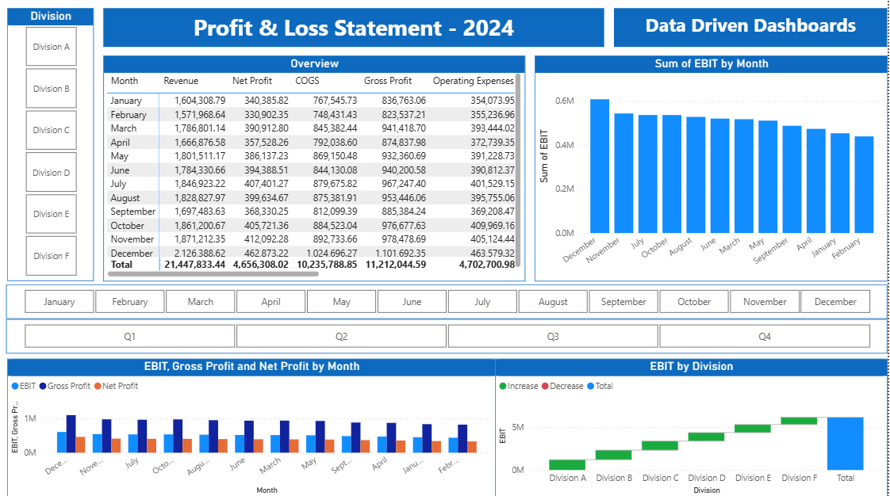

# Profit & Loss Statement Dashboard  

## 🛠 Tools Used  

---

---

## 📊 Description  

This project demonstrates an interactive **Power BI Profit & Loss Dashboard**. It highlights financial KPIs such as **Revenue, Gross Profit, EBIT, EBITDA, and Net Profit**, with drill-downs by **division, month, and quarter**. Built using a **mock P&L dataset**, this dashboard showcases advanced **data modeling, DAX measures, and visualization design** to deliver actionable insights for finance and operations teams.  

---

## 📂 Dataset  

- Dataset stored in **Excel** (P&L data).  
- Processed and cleaned with **Power Query**.  
- Final model built in **Power BI** with **DAX calculations** for KPIs and variance analysis.  

---

## ⭐ Features  

- **Overview P&L Report** – Revenue, COGS, Expenses, Gross Profit, EBIT.  
- **EBIT & EBITDA Analysis** – Trends and comparison to last year.  
- **Divisional Insights** – Drill down by Division A–F.  
- **Monthly & Quarterly Views** – Track performance over time.  
- **Interactive Visuals** – Waterfall charts, bar charts, and tables.  

---

## 📸 Preview  

### Full P&L Analysis  
  

### Division Drill-Down  
  

---

## 📁 Project Structure  

├── Profit_Loss_Dashboard  

│   ├── images        <- Screenshots & GIF previews  

│   ├── pbix          <- Power BI project file  

│   └── README.md     <- Documentation  

---

## 👩‍💻 Author  

**Ashlyn Strickland**  
- 🎓 Master’s Degree in Data Science  
- 📊 Certified Data Scientist | Power BI, Tableau, Excel, Python, R  
- 🌐 [datadrivendashboards.com](http://datadrivendashboards.com)  
- 💼 Open to collaborations in **business intelligence & analytics**  
