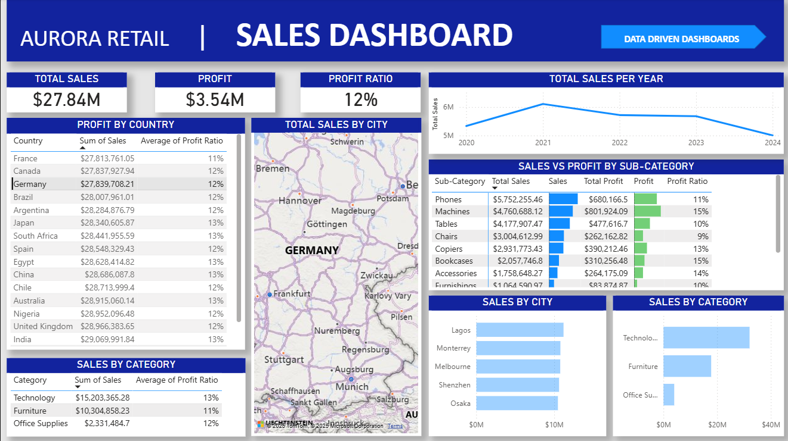

# Sales Performance Dashboard  

## 🛠 Tools Used  
       

## 💡 Skills Demonstrated  
       

---

.gif)

---

## 📊 Description  

This project demonstrates a professional **Power BI Sales Performance Dashboard**.  
It highlights:  
- **Global Sales Performance** → Country, region, and city-level analysis  
- **Profitability Insights** → Breakdown by product category & sub-category  
- **Top-Performing Areas** → Drill-throughs for cities and product lines  
- **Sales vs Profit Trends** → Dynamic trend analysis over time  

This dashboard empowers decision-makers with actionable insights into **revenue drivers, profitability, and performance patterns**, enabling smarter business strategies.  

---

## 📸 Preview  

### Overview Page  
.png)  

### Drilldown Page  

---

## 📁 Project Structure  

├── Sales_Performance_Dashboard  
│   ├── images <- Screenshots & GIF previews  
│   ├── pbix <- Power BI project file  
│   └── README.md <- Documentation  

---

## 👩‍💻 Author  

**Ashlyn Strickland**  
- 🎓 Master’s Degree in Data Science  
- 📊 Certified Data Scientist | Power BI, Tableau, Excel, Python, R  
- 🌐 [datadrivendashboards.com](http://datadrivendashboards.com)  
- 💼 Open to collaborations in **business intelligence & analytics**  

  <a href="../" style="text-decoration:none; font-size:22px;">
    ⬅️ <b>RETURN TO PORTFOLIO</b>
  </a>

